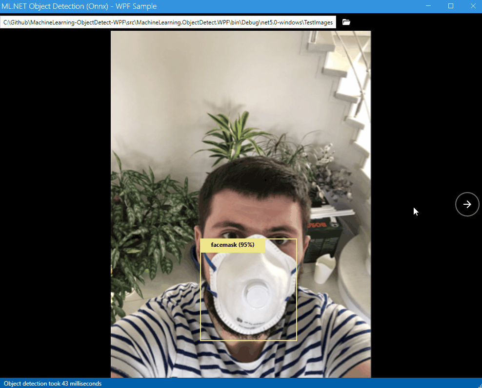
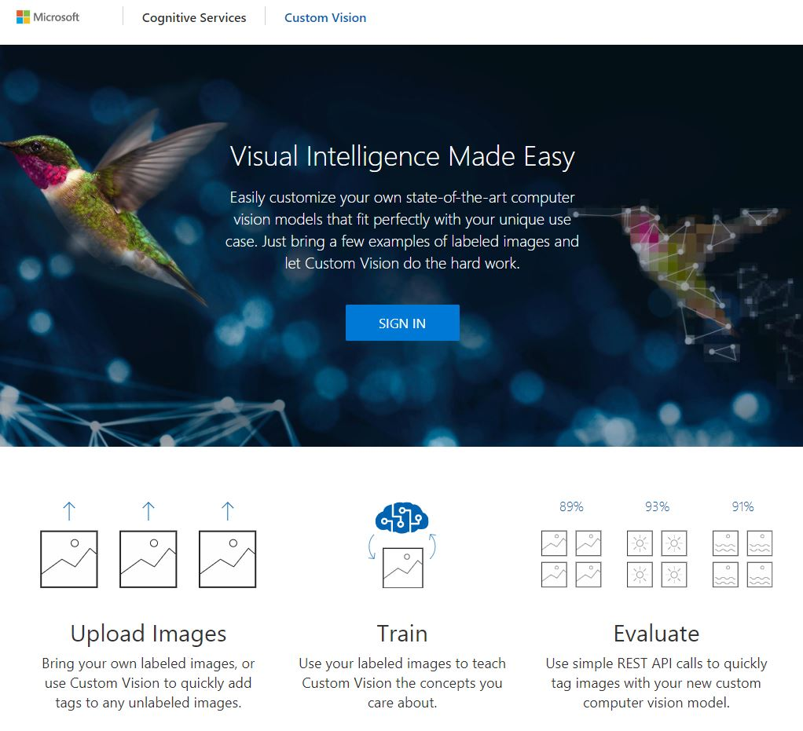
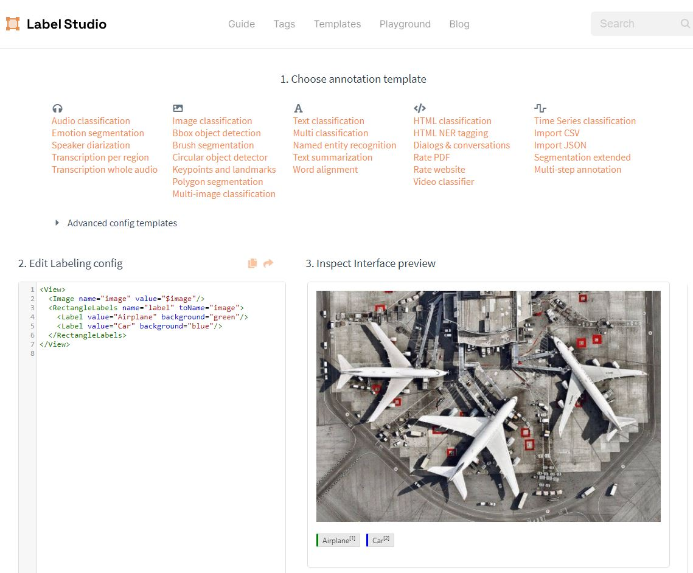
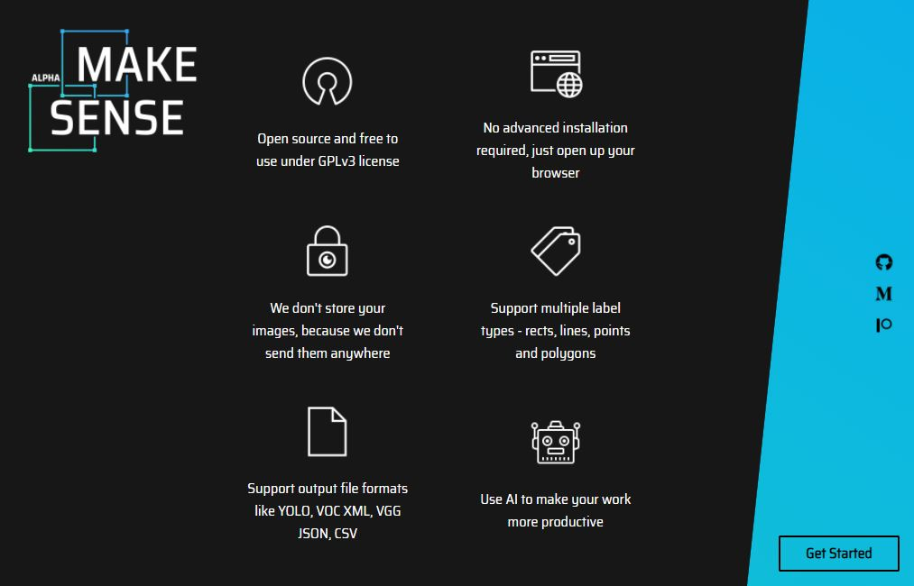
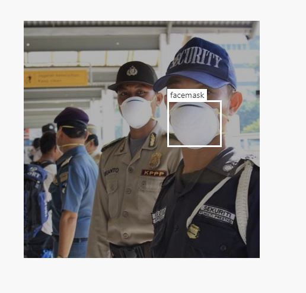

# Machine Learning Object Detection in .NET with WPF App
Complete sample for object detection in .NET using Machine Learning and WPF. From image labeling to training to final app.

> For sample/demonstration/understanding of the full cycle I will label and train with just a few images of a very simple problem. Labeling and model training depending the domain and complexity of the project is something best done by a Data Scientist specialist.
For .NET developers I think the important part is Part 3 so they can integrate with their software and add value. Labeling and model training can be outsource to a specialist or use one of the several public models available made by experts.

## Part 1 - Labeling
The first step to detect objects in images/video is to label them. There are several applications and websites for this. Opensource, comercial, local only, cloud backend to fit everyone needs/taste. Here is a short list of some of them:

* [VoTT - Microsoft Visual Object Tagging Tool](https://github.com/microsoft/VoTT)

  Can be run as a desktop application and works with local files or directly [online](https://vott.z22.web.core.windows.net/) using Azure Blob Storage. It allows to export to   several formats (Pascal VOC, TensorFlow recods, Azure Custom Vision Service, etc)
  
  

* [Azure Custom Vision Portal](https://www.customvision.ai/)

  It's part of Azure Cognitive Services and allows to upload images and label them directly in the web.

  

* [Label Studio](https://labelstud.io/)

  Open Source data labeling tool. Apart from labeling images for object detection it can also work with audio, texts, etc. You can run it locally with Docker in one minute.

  
  
  
* [Make Sense](https://www.makesense.ai/)

  Open Source annotation tool. It runs directly on the web and allows to export the bounding box labels in many formats.

  

* Comercial options (some with Free Tier)
  * [Super Annotate](https://superannotate.com/)
  * [Clarifai](https://www.clarifai.com/)
  * [Supervisely](https://supervise.ly/)
  * [Labelbox](https://labelbox.com/)

## Part 2 - Model training

* [Azure Custom Vision Portal](https://www.customvision.ai/)

  For this sample I used this simple tool for labeling and training. I used the [facemask dataset](https://www.kaggle.com/sshikamaru/face-mask-detection) from Kaggle and I just used 20 images for training and a few for testing. Labeling took me about two minutes and I did it very rough and model training took just 5 minutes.
  
  [See more details/pictures steps here](customvision-train)

  
  
* [TensorFlow](https://www.tensorflow.org/)

  ML.NET can work with TensorFlow models or you can convert to [ONNX format](https://onnx.ai/)

* [PyTorch](https://pytorch.org/)

  If you are comfortable with Python and export to ONNX

## Part 3 - WPF Application
In this sample I chose to use a .NET 5 WPF application so that the sample is helpful for .NET desktop developers. Obviously deploying the previous model as a Docker container or a REST API endpoint for web use is also possible and maybe even simpler and they are several samples/tutorials online for this.

The sample is based on [Microsoft Machine Learning Sample](https://github.com/dotnet/machinelearning-samples/tree/master/samples/csharp/end-to-end-apps/ObjectDetection-Onnx).

You can check the source code [here](src). As with most of my WPF projects I used MahApps and ReactiveUI but those are not required.
