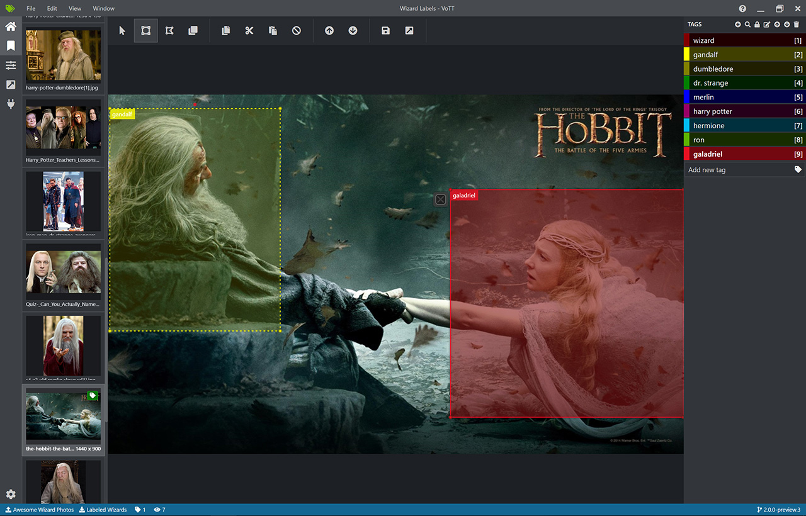

# Machine Learning Object Detection in .NET with WPF App
Complete sample for object detection in .NET using Machine Learning and WPF. From image labeling to training to final app

## Part 1 - Labeling
The first step to detect objects in images/video is to label them. There are several applications and websites for this. Opensource, comercial, local only, cloud backend to fit everyone needs/taste. Here is a short list of some of them:

* [VoTT - Microsoft Visual Object Tagging Tool](https://github.com/microsoft/VoTT)

  Can be run as a desktop application and works with local files or directly [online](https://vott.z22.web.core.windows.net/) using Azure Blob Storage. It allows to export to   several formats (Pascal VOC, TensorFlow recods, Azure Custom Vision Service, etc)
  
  

* [Azure Custom Vision Portal](https://www.customvision.ai/)

  It's part of Azure Cognitive Services and allows to upload images and label them directly in the web.

  

* [Label Studio](https://labelstud.io/)

  Open Source data labeling tool. Apart from labeling images for object detection it can also work with audio, texts, etc. You can run it locally with Docker in one minute.

  
  
  
* [Make Sense](https://www.makesense.ai/)

  Open Source annotation tool. It runs directly on the web and allows to export the bounding box labels in many formats.

  

* Comercial options (some with Free Tier)
  * [Super Annotate](https://superannotate.com/)
  * [Clarifai](https://www.clarifai.com/)
  * [Supervisely](https://supervise.ly/)
  * [Labelbox](https://labelbox.com/)

## Part 2 - Model training

## Part 3 - WPF Application
In this sample I chose to use a .NET 5 WPF application so that the sample is helpful for .NET desktop developers. Obviously deploying the previous model as a Docker container or a REST API endpoint for web use is also possible and maybe even simpler and they are several samples/tutorials online for this.
