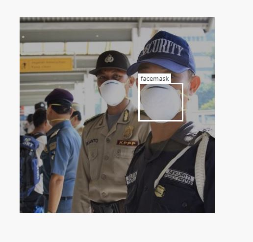

# Microsoft Custom Vision training and test
Some screenshots I made while training to show how simple it is. This is not meant to be a step by step guide, you can find several tutorials online.

## Create project

&nbsp;
&nbsp;

&nbsp;
&nbsp;

## Label

&nbsp;
&nbsp;

&nbsp;
&nbsp;

&nbsp;
&nbsp;

&nbsp;
&nbsp;

## Train

&nbsp;
&nbsp;

&nbsp;
&nbsp;

## Test

&nbsp;
&nbsp;

&nbsp;
&nbsp;

&nbsp;
&nbsp;

&nbsp;
&nbsp;

&nbsp;
&nbsp;

## Export

&nbsp;
&nbsp;

&nbsp;
&nbsp;
